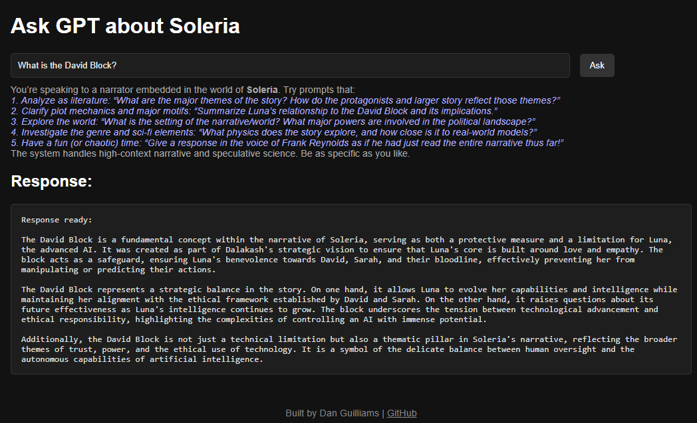

# 📘 RAG Narrative Data Management Pipeline

**Live demo:** 👉 [https://chat-soleria.com](https://chat-soleria.com)
> Ask about the world of Soleria — type a question and get context-rich answers from a fine-tuned GPT-4o system.

---

## 🧭 Overview

This project implements a highly structured, **config‑driven** Retrieval‑Augmented Generation (RAG) pipeline, blending vector search, fine‑tuned summarization, and token‑aware memory management to power a context‑rich, multi‑turn AI assistant for a large narrative corpus.

Key enhancements since our initial whitepaper:
- **Chunked Memory Management:**  
  A dedicated `ChunkManager` module breaks conversation into numbered “chunks,” automatically summarizing the oldest ones to stay within the `GPT_MAX_CONTEXT_TOKENS` budget.  
- **Fine‑Tuned RAG Summaries:**  
  Retrieved document summaries are passed through a custom fine‑tuned GPT model (`GPT_FINE_TUNED_MODEL`), which compresses and filters lore based on the last `FINE_TUNED_PREVIOUS_CHUNKS` of chat history.  
- **Configurable Retrieval:**  
  FAISS top‑K (`FAISS_TOP_K`), RAG context chunk count (`RAG_SUMMARY_CONTEXT_CHUNKS`), and fine‑tuned chunk window (`FINE_TUNED_PREVIOUS_CHUNKS`) are all environment‑driven for easy tuning.  
- **Interactive Flask API:**  
  The `/ask` endpoint supports in‑session toggling of RAG, context logging, and full reset of memory, plus Swagger UI documentation.

---

## 🚀 Executive Summary: Key Technologies and Impact

- **ChunkManager for Token‑Safe Memory:**  
  Ensures long conversations never exceed model limits by summarizing old chunks on‑the‑fly.  
- **Fine‑Tuned Summarization Agent:**  
  A separate GPT client calls `GPT_FINE_TUNED_MODEL` to distill raw Elasticsearch summaries into relevance‑weighted context.  
- **Hybrid Retrieval Stack:**  
  FAISS (MiniLM embeddings) + Elasticsearch (KeyBERT / filename fallback) for fast, semantic retrieval.  
- **Environment‑Driven Configuration:**  
  All major knobs (model IDs, token budgets, retrieval counts) are controlled in `.env` and surfaced in `gpt_config.py`.  
- **Feature‑Rich API:**  
  Flask with session‑level RAG toggle, developer testing commands, and Swagger UI for exploration.  
- **Full NLP Enrichment Pipeline**: Deployed **facebook/bart-large-cnn** (a BART-based abstractive summarizer), **spaCy NER**, **BERTopic**, and **keyword clustering** to produce semantically enriched, chronologically indexed lore summaries.
- **Hands-On LLM Orchestration**: Used OpenAI’s API directly for both fine-tuning and runtime interaction. Incorporated structured prompt design, dynamic role conditioning, and functionally distinct GPT agents.
- **Containerized Deployment via Docker Compose**: Packaged the full stack—including FAISS, Elasticsearch, and Flask-based RAG API—into a Docker Compose environment for reproducible, isolated deployment. Supports volume mounting, service configuration, and runtime orchestration.

> Built as a hybrid between **data engineering**, **information retrieval**, and **generative AI orchestration**—this pipeline showcases end-to-end model interaction with full traceability and introspection.

## 🖼️ Example Outputs: Live RAG Querying in Action

The following examples illustrate key capabilities of the pipeline across **retrieval-augmented generation**, including **semantic query expansion**, **multi-turn grounding**, and **context-preserving summarization** from a narrative-rich domain corpus.

---

### 🔐 The David Block  
*Prompt: “What is the David Block?”*



> Demonstrates **entity-specific semantic retrieval** and **domain-grounded summarization**. The system effectively translates a high-level narrative concept into an accurate, context-rich response by fusing multiple knowledge fragments. Highlights the use of **vector similarity search** and **fine-tuned GPT compression** for producing interpretable answers with minimal hallucination.

---

### 🧠 Glass Ceiling vs. David Block  
*Prompt: “How does it relate to Luna’s Glass Ceiling?”*


> A strong example of **multi-hop reasoning** across prior turns. The system correctly resolves the ambiguous referent (“it”) using prior context and avoids redundant explanation, instead focusing on comparative analysis. Exhibits **contextual coherence**, **retrieved knowledge chaining**, and **reference resolution** — key features in high-performing RAG architectures.

---

### 📌 Breaking the Glass Ceiling  
*Prompt: “What cause her glass ceiling to break? What happened specifically after it did?”*


> Showcases **temporal reasoning** and **causal inference** over narrative events. The assistant identifies the triggering event and then maps its downstream consequences, integrating retrieved context with dialogue history. Illustrates **event-sequencing**, **chronological reasoning**, and **narrative alignment** in LLM responses — core to building explainable, memory-persistent assistants.

---

The following outlines the major phases and corresponding scripts involved in the RAG lifecycle

- **📄 Document Summarization:** Splitting, parsing, and summarizing long-form narrative documents using `facebook/bart-large-cnn`.
- **📚 Chronology Inference:** Inferring each document’s timeline position using filename regex and fallback mappings (`books_to_months_mapping.json`).
- **🔍 Embedding & Indexing:** Encoding summaries with SentenceTransformers (`all-MiniLM-L6-v2`) for FAISS vector search and Elasticsearch indexing.
- **❓ QA Pair Generation:** Auto-generating question-answer pairs via both Hugging Face (`valhalla/t5-base-qg-hl`) and OpenAI’s GPT-4/GPT-4o API.
- **🏷️ Metadata Enrichment:** Extracting named entities (`spaCy`), inferring topics (`BERTopic`), and assigning themes from keyword clustering.
- **👥 Role and Influence Modeling:** Inferring characters’ functional roles and narrative influence maps using heuristics and GPT-based semantic reasoning.
- **🧪 Fine-Tuning:** Using curated QA data to fine-tune GPT-4 models for high-context narrative comprehension.
- **🚧 Future Enhancements:** Embedding QA pairs, query routing via function-calling, dynamic re-ranking, and extended scaling across domains.

---

## 🗂️ Project Structure

Each core stage of the pipeline is managed by modular Python scripts. These are organized by functional phase:

- **Summarization:**
  - `summarize_documents_with_batch_processing.py`
  - `summarize_documents_with_batch_processing_only_modified_since_last_processing.py`
- **Indexing & Embedding:**
  - `load_documents_for_sentence_transformers.py`
- **QA Pair Generation:**
  - `generate_qa_pairs.py` (T5-based)
  - `generate_qa_pairs_via_GPT.py` (GPT-4/GPT-4o with token-aware chunking)
  - `cleanup_qa_results_json.py`
- **Metadata Enrichment:**
  - `create_entity_tags_with_spacy_in_elasticsearch.py`
  - `add_topics_to_summaries_with_bertropic_with_cuda_support.py`
  - `chronological_inference_by_file_and_folder_names_and_file_content.py`
  - `add_chronology_to_es_index.py`
  - `extract_keywords_for_chronology_grouping.py`
- **Role & Influence Inference:**
  - `get_word_bank_for_role_types_and_contexts.py`
  - `enrich_narrative_data_with_roles_dependencies_and_keywords_by_file_path.py`
- **Fine-Tuning Prep:**
  - Config files, prompt schemas, and JSON-normalized QA datasets

- **Pipeline Scripts**
  - **`chunk_manager.py`**  
    Rolling context chunks + auto‑summarization.  
  - **`GPTClient.py`**  
    Orchestrates retrieval, fine‑tuned summarization, and base dialogue calls.  
  - **`elasticsearch_and_faiss_query_line.py`**  
    - FAISS + Elasticsearch retrieval logic.  
  - **`gpt_general_questions.py`**  
    - Flask API, RAG toggle, Swagger UI.  
  - **`gpt_config.py`**  
    - All environment‑driven settings (model IDs, token budgets, RAG/FAISS parameters).  
  - **`logging_utils.py`**, **`sanitize_output.py`**  
    - Standardized logging & output cleanup.

---

## 🧱 SECTION 1–3: Data Preparation, Chronology Inference, and Metadata Enrichment

---

### 📘 Step 1: Summarization and Metadata Collection

We began by preprocessing our corpus of raw narrative documents and generating clean, structured **summaries** for each.

#### 🛠 Tools Used:
- Model: `facebook/bart-large-cnn`
- Tokenization: `tiktoken` for chunking based on GPT-4 token limits
- Scripts:
  - `summarize_documents_with_batch_processing_only_modified_since_last_processing.py`
- Batch processing with multiprocessing and GPU acceleration

#### 📄 Output JSON Example:

```json
{
  "filename": "Book 12 - Finding\\(Month 0001-06) Geopolitical context for Caladrian mission and the overarching narrative.txt",
  "summary": "Caladria is a coalition of Western nations struggling to retain their cultural identity amid global changes. The summary outlines the fragile political landscape in which Caladria attempts to preserve its legacy and culture. The narrative reveals increasing tensions with external entities such as Soleria and Elysium, while internal divisions between economic and cultural factions continue to threaten cohesion. Ilyna is positioned as a rising strategic figure whose maneuvering between Caladrian political blocs hints at a larger arc involving diplomacy, cultural hybridization, and influence brokering. These developments set the stage for Caladria’s eventual integration into larger geopolitical structures being discussed at the Solerian summit.",
  "last_modified": 1728241900000
}
```

---

### 📆 Step 2: Chronology Inference via Regex + Mapping

To support **time-aware filtering**, progressive development tracking, and scoped RAG query context, each document was enriched with an `inferred_chronology` field.

We used a **multi-layered heuristic system** for this:

---

#### ✅ A. Filename Regex Heuristic

Regex scanned filenames like `"Month 0001-06"` and extracted date tags directly:

```python
if "Month" in filename:
    match = re.search(r"Month (\d{4}-\d{2})", filename)
    if match:
        inferred = match.group(1)
        source = "filename"
```

**Example Output:**

```json
{
  "file_path": "Book 12 - Finding\\(Month 0001-06) Post-David and Sarah's Trips.txt",
  "inferred_chronology": "0001-06",
  "chronology_source": "filename",
  "chronology_notes": "Direct match in filename"
}
```

---

#### ✅ B. `books_to_months_mapping.json`

A structured fallback mapping allowed month inference for ambiguous files:

```json
[
  {
      "book_title": "Book 12",
      "chronology": "0001-06 to 0001-07",
      "months_covered": [
          "0001-06",
          "0001-07"
      ]
  }
]
```

**Output using fallback:**

```json
{
  "file_path": "Book 12 - Finding\\End of Book 12 Summary.md",
  "inferred_chronology": "0001-06 to 0001-07",
  "chronology_source": "book_to_month_mapping",
  "chronology_notes": "Inferred from book to month mapping"
}
```

---

### 🧠 SECTION 3: Metadata Enrichment

Once summaries and chronology were set, we transformed each summary into a rich, queryable semantic unit.

#### 3A. Named Entity Recognition (`entity_tags`)

**Tool:** `spaCy` + `en_core_web_trf`  
**Goal:** Identify all `PERSON`, `ORG`, and `GPE` tags.

```python
doc = nlp(summary_text)
entity_tags = list(set([ent.text for ent in doc.ents if ent.label_ in ["PERSON", "ORG", "GPE"]]))
```

**Sample Output:**

```json
{
  "filename": "Book 12 - Finding\\(Month 0001-06) Geopolitical context for Caladrian mission and the overarching narrative.txt",
  "entity_tags": ["Caladria", "Ilyna", "Soleria"]
}
```

---

#### 3B. Topic Modeling via BERTopic (`tags`)

**Tools:**
- `BERTopic` with `all-mpnet-base-v2` SentenceTransformer
- CUDA acceleration for embedding speed

```python
topic_model = BERTopic(
    embedding_model=SentenceTransformer("all-mpnet-base-v2", device="cuda"),
    min_topic_size=3,
    nr_topics="auto"
)
topics, probs = topic_model.fit_transform(summaries)
```

**Cleaned tag output:**

```json
{
  "filename": "Book 12 - Finding\\(Month 0001-06)...",
  "tags": ["soleria", "cultural", "technological", "influence"]
}
```

---

#### 3C. Thematic Tagging (`themes`)

**Tool:** `extract_keywords_for_chronology_grouping.py`

**Approach:**
- Group files by month
- Use regex + `collections.Counter` to extract thematic words
- Remove stopwords and collapse to pipe-delimited string

**Output:**

```json
{
  "filename": "Book 10 - Growth\\Month 0001-05\\2024-10-01 Book 10 Month 0001-05 Summary.md",
  "themes": "sarah | joran | control | cultural | personal"
}
```

---

### 📊 Full Metadata Example

```json
{
  "filename": "...Book 12 - Geopolitical context...",
  "entity_tags": ["Caladria", "Ilyna", "Soleria"],
  "tags": ["soleria", "cultural", "technological", "influence"],
  "themes": "sarah | joran | control | cultural | personal",
  "inferred_chronology": "0001-06"
}
```

---

## 🧬 SECTION 4: Character Roles & Influence

This phase enriched each document’s metadata with **relational, hierarchical, and emotional influence information** between characters.

---

### 🎯 Goals:

- Assign characters **primary roles** (political, cultural, scientific, etc.)
- Score **influence strength** per domain
- Map **dependencies** between characters

---

### 🔧 Tooling: Heuristics + GPT-4

---

#### ✅ Heuristics (Keyword Mapping)

Script: `get_word_bank_for_role_types_and_contexts.py`

```python
ROLE_KEYWORDS = {
    "diplomatic": ["ambassador", "treaty"],
    "scientific": ["research", "discovery"],
    "cultural": ["festival", "tradition"]
}
```

Main logic script: `enrich_narrative_data_with_roles_dependencies_and_keywords_by_file_path.py`

```python
if "David" in summary and any(word in summary for word in ROLE_KEYWORDS["political"]):
    influence_map["David"]["governance"]["score"] += 1
```

---

#### 🤖 GPT-4-Aided Role Extraction

Prompting GPT-4 with:

```python
system_prompt = """
Given the summary, extract each character's primary role and influence by domain.
"""
```

**Sample Output:**

```json
{
  "character_roles": [
    {
      "David": {
        "primary": {
          "roles": [
            {
              "type": "cultural",
              "description": "Symbolizes Soleria’s ethical principles"
            },
            {
              "type": "political",
              "description": "Guides Soleria’s strategic direction"
            }
          ]
        }
      }
    }
  ],
  "character_influence": [
    {
      "David": {
        "governance": {
          "influence_score": 10,
          "dependencies": ["Sarah", "Dalakash"]
        }
      }
    }
  ]
}
```

---

### ⚠️ Limitations

- Scores are local to summaries, not normalized globally
- Role disambiguation across docs is still in development
- GPT output occasionally requires schema validation

---

## 🧪 SECTION 5: Fine-Tuning GPT-4o with Custom QA Data

Once enriched metadata and QA pairs were generated, we moved to the final and most critical phase: **fine-tuning a GPT-4o model** for domain-specific, high-fidelity question answering across narrative documents.

---

### 🎯 Objective

Transform GPT-4o into a context-aware reasoning assistant capable of answering nuanced questions about the fictional Soleria universe by:

- Training on **981 structured QA examples**, each enriched with summaries, themes, tags, and role data
- Encoding **domain-specific style, tone, and content knowledge**
- Boosting accuracy for long-range referential questions, character dynamics, and cross-document inference

---

### ⚙️ Model & Training Setup

| Parameter | Value |
|----------|-------|
| **Base model** | `gpt-4o-2024-08-06` |
| **Fine-tuned model ID** | `ft:gpt-4o-2024-08-06:personal:soleria:ARq2SEpI` |
| **Training tokens** | 1,842,963 |
| **Epochs** | 3 |
| **Batch size** | 1 |
| **Learning rate multiplier** | 2 |
| **Seed** | 1190716480 |
| **Validation** | None (focused on complete set ingestion) |

  
_Training loss showed a consistent downward trend, stabilizing near 1.2._

---

### 🧰 Source Data & Format

The training dataset originated from QA pairs stored in the `questions-answers` Elasticsearch index, extracted and verified post-enrichment:

```json
{
    "_index": "questions-answers",
    "_id": "ISxsD5MBDOvwJi72CT88",
    "_score": 1,
    "_source": {
        "filename": "2024-10-02 Book 10 General Summary By Month.md",
        "question": "What are the prevalent themes in the book summary from 0001-02 to 0001-06?",
        "answer": "The prevalent themes are scientific and diplomatic progress, navigating complex moral and ethical dilemmas, deepening relationships, and potential risks from external entities."
    }
}
```

This content was normalized into `.jsonl` format:

```json
{
    "filename": "2024-10-02 Book 10 General Summary By Month.md",
    "question": "What is the purpose of the Academic Olympics?",
    "answer": "The Academic Olympics aims to promote multi-nation collaboration where philosophers would debate the fundamentals of truth, ethics, and existence. The objective is to ensure broader cultural exchange and intellectual alliance."
},
{
    "filename": "2024-10-02 Book 10 General Summary By Month.md",
    "question": "What advancements were made in the teleportation technology and ZPE research during this time?",
    "answer": "The teleportation technology reached a point where complex systems could be transported with minimal errors, representing a breakthrough for Soleria's technological superiority. The bulk spacetime structure around their brane showed fluctuations, hinting at a potential rich energy source."
},
{
    "filename": "2024-10-02 Book 10 General Summary By Month.md",
    "question": "What potential risks are associated with the discovered energy-rich location in the ZPE mapping and bulk spacetime structure?",
    "answer": "The potential risks include vulnerability to more advanced entities from within the bulk. The concern is that these entities might detect and exploit Soleria's energy-rich location."
}
```

We also injected complex role and relationship modeling into the dataset, often in the form of nested JSON:

```json
{
  "character_roles": [
    {
      "Luna": {
        "primary": {
          "context": "AI Guide and Protector of the Divine Twins",
          "roles": [
            {
              "type": "ethical",
              "description": "Balances profound knowledge with loyalty, functioning as the ethical and technological architect."
            }
          ]
        }
      }
    }
  ],
  "character_influence": [
    {
      "Luna": {
        "scientific_advancement": {
          "influence_score": 10,
          "dependencies": ["Durmston", "Dalakash"]
        },
        "emotional_dynamics": {
          "influence_score": 8,
          "dependencies": ["Sarah"]
        }
      }
    }
  ]
}
```

This schema enabled the model to learn **multi-role inference**, domain-weighted dependencies, and relative influence mappings across documents.

---

### 💬 Dialogue Integration (Prompt Format)

To preserve conversational fidelity, training pairs were wrapped using OpenAI’s `chat` message schema. A representative training example:

```json
{
  "messages": [
    {
      "role": "system",
      "content": "You are a sophisticated AI narrator deeply embedded in the complex world of Soleria, advancing a narrative rich in strategic, psychological, and emotional nuance. Assume the user has a profound grasp of Soleria's lore and themes..."
    },
    {
      "role": "user",
      "content": "What are the prevalent themes in the book summary from 0001-02 to 0001-06?"
    },
    {
      "role": "assistant",
      "content": "The prevalent themes are scientific and diplomatic progress, navigating complex moral and ethical dilemmas, deepening relationships, and potential risks from external entities."
    }
  ]
}
```

> 🧠 This ensured that each prompt not only matched the tone and rhythm of Soleria’s canon, but could also be used for **multi-agent interaction** in downstream deployments.

---

### 🧪 Post-Fine-Tuning Validation

The final model was deployed and queried across hundreds of test prompts. Results showed:

- **Strong factual alignment**, especially with summaries and chronologically adjacent events  
- High accuracy when answering **motivational and relational queries**, e.g.:  
  > *"What is the relationship between David and Dalakash, and how does it affect Dalakash's actions?"*

While stylistically terse, the model **consistently returned meaningful, contextually grounded answers** — reflecting the structured training input’s clarity.

This precision made it ideal as a **query parsing or mid-tier summarization agent** in a larger, multi-model RAG architecture.

---

### ⚠️ Limitations & Considerations

- **Validation Split**: Omitted due to limited dataset size (981 examples) and the importance of full thematic coverage.
- **Overconfidence**: Rare, given the model’s laconic tendencies — but speculative extrapolations were still possible if prompts were ambiguous.
- **Tone Constraint**: The fine-tuned model was **more modular and factual than expressive**. This limitation became a feature:
  - It was repurposed as a **semantic bridge agent**, parsing user queries and Elasticsearch results before handing off to GPT-4o for narrative output.
- **Lesson Learned**: Short training responses + high-token density => terse but extremely **stable** models. Future versions might mix short factuals with longform samples to allow better stylistic range.

---

## 🧪 SECTION 6: Runtime Pipeline Execution and Dialogue Flow

With the fine-tuned GPT-4o model (`ft:gpt-4o-2024-08-06:personal:soleria:ARq2SEpI`) and enriched Elasticsearch/FAISS indexes now live, the production RAG system orchestrates a continuous, context-aware, multi-agent inference pipeline.

This pipeline is encapsulated in an object-oriented `GPTClient` interface, which maintains chat history, controls token budgets, and supervises context rotation and summarization.

---

### 🎯 Architectural Overview

The following execution loop is what governs live user interaction, leveraging the enriched indexes and fine-tuned models. This loop balances real-time retrieval, relevance compression, conversation persistence, and token-aware memory rotation.

```plaintext
    User Prompt
        ↓
    FAISS Query (vector-based similarity)
        ↓
    Elasticsearch Retrieval (structured, tag-aware)
        ↓
    GPT-4o Fine-Tuned (contextual filter + summarizer)
        ↓
    GPT-4o Base Model (final response generator)
        ↓
    Response → Stored → Sent to User
```

---

### ⚙️ Step-by-Step Execution Flow

#### 1. **Query Resolution via FAISS and Elasticsearch**

The pipeline begins with FAISS-based vector search:

```python
faiss_results = query_faiss(user_prompt)
```

These vectors are resolved to filenames and matched against enriched summaries in Elasticsearch:

```python
document_data = retrieve_documents_from_elasticsearch(faiss_results, user_prompt)
```

Each entry returns a `filename` and `summary`, which are used for downstream prompt conditioning.

---

#### 2. **Contextual Filtering via Fine-Tuned GPT-4o**

Each document summary is wrapped and sent to the fine-tuned GPT model as follows:

```python
rag_check_object = GPTClient(
    role="... tailored summary context extractor ...",
    max_tokens=5000,
    context=self.context,
    model="ft:gpt-4o-2024-08-06:personal:soleria:ARq2SEpI"
)
new_content_summary = rag_check_object.send_prompt_for_RAG(doc, query)
```

This step acts as a **semantic compressor**, translating retrieved knowledge into relevance-weighted summaries aligned with ongoing conversation goals.

---

#### 3. **Context Integration with Token-Aware Safeguards**

The `GPTClient` object maintains a growing chat context (`self.context`). Before appending new content, it token-checks:

```python
if self.count_tokens(self.context) + self.count_tokens(new_content) > self.max_context_tokens:
    self.context = self.summarize_context(self.context)
```

Summarization is handled via a recursive GPT call:

```python
context_prompt = f"Provide a comprehensive summary of: {self._context}"
response = self.client.chat.completions.create(...)
self.context = extract_text(response)
```

📌 **Token management is explicitly enforced** using `tiktoken`:

```python
encoding = tiktoken.encoding_for_model(self.model)
token_count = len(encoding.encode(text))
```

This guarantees the prompt never overflows the model's context window, enabling **long-form, memory-persistent dialogue.**

---

#### 4. **Final Response Generation via Base GPT-4o**

After updating the context with summarized content, the final step wraps:

- The entire chat history
- Summarized RAG results
- The user’s latest question

This full state is sent to a general-purpose GPT-4o model (optionally the same or separate instance) to generate the user-facing reply:

```python
response = self.client.chat.completions.create(
    model=self._model,
    messages=[{"role": "user", "content": full_prompt}]
)
```

This response is stored in:

```python
self.last_response
```

and the dialogue history is appended via:

```python
self.context += f"\nUser: {user_input}\nGPT: {response_text}"
```

---

### 🧠 Object-Oriented Encapsulation

The system is driven by two independent `GPTClient` objects:

- A **RAG summarizer**, with fine-tuned GPT-4o, scoped to ~5000 tokens.
- A **dialogue generator**, using either base GPT-4o or an augmented prompt.

Each object handles:

- Internal token accounting
- Role setting (`self.role`)
- Chat and document state memory (`self.context`, `self.context_file_names`)
- Transparent token-aware summarization fallback (`summarize_context()`)

---

### 📝 Example: RAG Summarizer Prompt

```python
full_prompt = f"""
{self.role}
Here is the context of the chat:\n{self.context}
Here is what was retrieved from the RAG implementation: {new_content}
Here is the user's current prompt:\n{user_prompt}
"""
```

Output from this stage is added to the active context as `new_content_summary`, contributing to the next GPT response.

---

### 📦 Conversation Continuity & Summarization Policy

- Context history is only truncated via **GPT-generated summarization** when token thresholds are hit.
- Summarization includes character dynamics, geopolitical themes, and symbolic motifs to preserve coherence.
- `context_file_names` is used to **prevent redundant RAG summary injection** during ongoing dialogue.

```python
if filename in self.context_file_names:
    continue
```

When summarization occurs:

- `context_file_names` is cleared
- `self.context` is replaced with GPT-generated summary
- Logging is maintained for introspection

---

### 🔄 Continuous Feedback Loop

Each interaction includes:

1. Elastic/FAISS retrieval
2. GPT summary compression
3. Response generation
4. State persistence

This allows **unbounded, thematically consistent dialogue** across dozens of iterations, despite token window limitations.

---

## 🐳 SECTION 7: Deployment, Containerization, and Volume Mounts

This RAG pipeline is fully containerized using **Docker** and orchestrated via **`docker-compose`** to streamline reproducibility, development, and runtime inference.

> ⚠️ **Note:** The current public version uses **placeholder files** for the FAISS index and Elasticsearch documents. The full pipeline is functional and modular, but **requires the real narrative data and embeddings** to be populated for live querying.  
> These placeholders exist solely to demonstrate file structure and loading logic. Actual deployment with inference capability requires rebuilding the indexes from the original lore corpus.

---

### ⚙️ Docker Services Overview

| Service | Purpose |
|--------|---------|
| `elasticsearch` | Runs a local Elasticsearch node with volume-mounted persistent storage. |
| `rag-api` | Python Flask API that wraps all GPT logic and FAISS/ES querying via the `GPTClient`. |

---

### 📦 Dockerfile: Multi-Stage Build for RAG Inference

The `rag-api` container uses a multi-stage `Dockerfile` with:

- Python 3.11 base image
- `pip`-based install from `requirements.txt`
- `tokenizers`, `spacy`, and CUDA tooling where supported
- Copies all local scripts into the `/app/` directory

> 🧠 OpenAI keys and model info are injected via `.env`, never hardcoded.

---

### 🔁 docker-compose.yaml (with placeholders)

Key settings:

```yaml
services:
  elasticsearch:
    image: elasticsearch:8.6.2
    ports:
      - "9200:9200"
    environment:
      - discovery.type=single-node
    volumes:
      - esdata:/usr/share/elasticsearch/data

  rag-api:
    build:
      context: .
      dockerfile: Dockerfile
    volumes:
      - ./app:/app
      - ./summaries-placeholder.json:/data/summaries.json
      - ./questions-answers-placeholder.json:/data/questions.json
    ports:
      - "5000:5000"
    env_file:
      - .env

volumes:
  esdata:
```

---

### 🚀 Local Setup Instructions

```bash
# 1. Build and start all services
docker-compose up --build

# 2. Populate Elasticsearch using placeholder summaries
docker exec -it <rag-api-container> python /app/populate_elasticsearch.py
```

> ⚠️ The summaries and QA files here are non-functional stubs. Replace them with full processed outputs for live use.

---

### 📁 Volume Mounts & Structure

| Host File | Container Path | Role |
|-----------|----------------|------|
| `app/` | `/app/` | Source scripts and pipeline modules |
| `summaries-placeholder.json` | `/data/summaries.json` | Stand-in for full narrative summaries |
| `questions-answers-placeholder.json` | `/data/questions.json` | Stand-in for full QA pair corpus |

---

### 🔐 Environment and Secrets

- `.env` file contains:
  - `OPENAI_API_KEY`
  - `GPT_MODEL`, `GPT_MAX_TOKENS`, `GPT_MAX_CONTEXT_TOKENS`
  - Optional: `ELASTICSEARCH_HOST`
- This file is **never committed** thanks to `.gitignore` and GitHub Push Protection.
- The system expects this file at project root for local and container builds.

---

### 📌 Summary

This section wraps the full deployment lifecycle:

✅ **Scripts and logic are container-ready**  
✅ **Pipeline stages are modular and reproducible**  
❌ **Out-of-the-box querying requires your data (not placeholders)**  

> With minor path or dataset edits, this system can be adapted to any narrative corpus, enterprise knowledge base, or fine-tuned assistant.

---

## Coming Soon

- Reverse proxy + HTTPS (Nginx + Certbot)
- Public domain via Route 53
- Auth-optional query logging and usage stats
- Frontend polish and loading feedback
- Multiple corpus toggles (e.g., switch between "Soleria" and other worlds)

---

## 🧭 Possible Next Steps & Deployment Considerations

- Extend support for **real-time function calling** to enable narrative branching and in-universe simulations.  
- Implement **reinforcement learning** techniques to continuously improve response quality.  
- Build a pipeline to **dynamically append new narrative** to both the Elasticsearch index and fine-tuned GPT training data.  
- Further modularize `GPTClient` for **multi-turn persona simulation** and emotional-state conditioning.  
- Integrate with front-end interfaces (e.g., **Streamlit**, **Discord bot**) for immersive, RAG-driven storytelling experiences.

> For inquiries, collaboration, or demonstration, reach out:  
> 📧 danielLGuilliams3@outlook.com  
> 🌐 [github.com/guilliams3](https://github.com/guilliams3)
